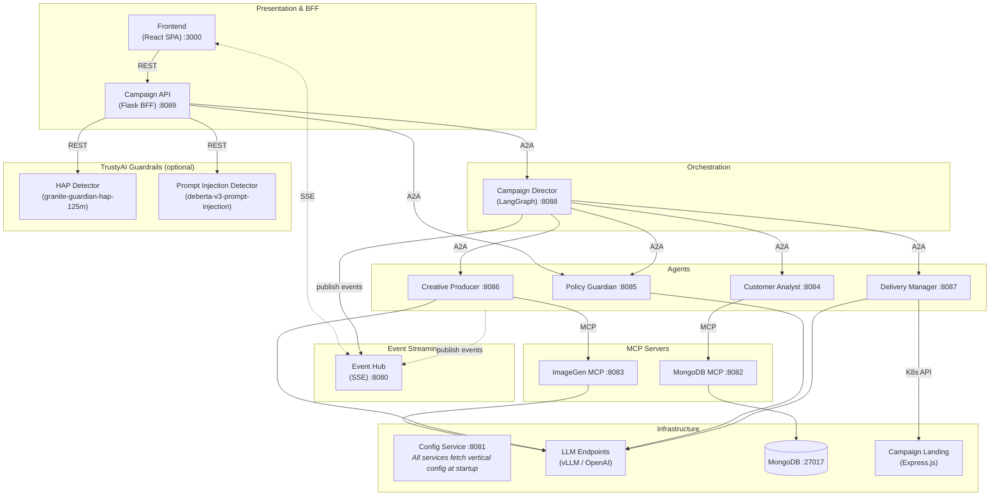

# Marketing AI Assistant

> Forked from [JonkeyGuan/marketing-assistant](https://github.com/JonkeyGuan/marketing-assistant) with modifications for persistent storage (PVC), campaign lifecycle management (delete + K8s cleanup), SSE event streaming, production deployment workflow, RBAC hardening and more.

An AI-powered Marketing Campaign Assistant that accelerates campaign creation through a web UI. The system uses a multi-agent architecture where each agent is an independent microservice communicating via the [Google A2A v1.0 protocol](https://github.com/a2aproject/a2a-python) and [MCP](https://modelcontextprotocol.io/), deployable on Red Hat OpenShift AI (RHOAI).

## Features

- Create marketing campaigns through a guided wizard UI
- Generate landing pages with AI (HTML/CSS/JS)
- AI-powered policy review and brand compliance guardrails
- 4-layer content safety: regex competitor filter, HAP detection, prompt injection detection, LLM policy review
- Generate and send bilingual marketing emails (English / 中文)
- Retrieve customer profiles for personalized targeting
- Real-time progress tracking via Server-Sent Events
- Human-in-the-loop approval workflows (preview → go live)
- Containerize and deploy campaigns to OpenShift
- Vertical configuration — switch industries without code changes

## Architecture



## Services

| Service | Port | Protocol | Description |
|---|---|---|---|
| [event-hub](event-hub/) | 8080 | SSE | Real-time event bus for progress tracking |
| [config-service](config-service/) | 8081 | REST | Vertical configuration API — serves industry config |
| [mongodb-mcp](mongodb-mcp/) | 8082 | MCP | MongoDB customer data access |
| [imagegen-mcp](imagegen-mcp/) | 8083 | MCP | AI hero image generation |
| [customer-analyst](customer-analyst/) | 8084 | A2A v1.0 | Retrieves customer profiles via MongoDB MCP |
| [policy-guardian](policy-guardian/) | 8085 | A2A v1.0 | Campaign policy validation via LLM |
| [creative-producer](creative-producer/) | 8086 | A2A v1.0 | Generates HTML landing pages via Code LLM |
| [delivery-manager](delivery-manager/) | 8087 | A2A v1.0 | Emails, preview/production deployment |
| [campaign-director](campaign-director/) | 8088 | A2A v1.0 | LangGraph orchestrator — coordinates all agents |
| [campaign-api](campaign-api/) | 8089 | REST | Flask BFF with guardrail checks |
| [frontend](frontend/) | 3000 / 8080 | HTTP | React SPA — campaign wizard, SSE progress, inbox (nginx in prod) |
| [campaign-landing](campaign-landing/) | 3001 | HTTP | Express.js — serves personalized landing pages |

## Project Structure

```
marketing-assistant/
├── frontend/               # React SPA
├── campaign-api/           # Flask API gateway
├── campaign-director/      # LangGraph orchestrator
├── creative-producer/      # A2A agent: HTML generation
├── customer-analyst/       # A2A agent: customer data
├── delivery-manager/       # A2A agent: deployment & email
├── policy-guardian/        # A2A agent: policy validation
├── event-hub/              # SSE event bus
├── mongodb-mcp/            # MCP server: MongoDB
├── imagegen-mcp/           # MCP server: image generation
├── config-service/         # Vertical configuration REST API
├── campaign-landing/       # Landing page server
├── mongodb/                # MongoDB: local run/stop scripts + k8s manifests
├── infra/
│   ├── README.md           # Infrastructure setup order
│   ├── models/             # LLM model deployment (vLLM + KServe + HF auto-download)
│   ├── guardrails/         # TrustyAI guardrails (HAP, prompt injection, orchestrator)
│   ├── mlflow/             # MLflow + OTEL Collector (tracing infrastructure)
│   └── keycloak/           # Keycloak SSO (PostgreSQL + Keycloak server)
├── build-and-push.sh       # Build & push all container images
├── deploy.sh               # Deploy application to OpenShift
├── undeploy.sh             # Remove application from OpenShift
├── fill-env.sh             # Fill k8s.yaml templates → .k8s.yaml (tokens, domain)
├── clear-traces.sh         # Clear MLflow tracing data
├── run.sh                  # Start all services locally
└── stop.sh                 # Stop all services
```

Python services follow a common layout:

```
<service>/
  app/
    __init__.py
    __main__.py            # Entry point (uv run app)
    settings.py            # Pydantic settings
  k8s.yaml                 # OpenShift manifests
  Containerfile
  build.sh
  pyproject.toml
  .env.example
```

## Prerequisites

- Python 3.11+
- [uv](https://docs.astral.sh/uv/) package manager
- Node.js 18+ (for frontend and campaign-landing)
- Podman (for MongoDB)
- LLM endpoints optional (mock/fallback mode works without them)

## Quick Start

```bash
# Start all services
./run.sh

# Stop all services
./stop.sh
```

Or start individually in order:

```bash
# 1. MongoDB
cd mongodb && ./run.sh

# 2. Event Hub + Config Service
cd event-hub && uv sync && uv run app
cd config-service && uv sync && uv run app

# 3. MCP servers
cd mongodb-mcp && uv sync && uv run app
cd imagegen-mcp && uv sync && uv run app

# 4. Agents
cd customer-analyst && uv sync && uv run app
cd policy-guardian && uv sync && uv run app
cd creative-producer && uv sync && uv run app
cd delivery-manager && uv sync && uv run app

# 5. Orchestrator + API
cd campaign-director && uv sync && uv run app
cd campaign-api && uv sync && uv run app

# 6. Frontend
cd frontend && npm install && npm start
```

Open `http://localhost:3000` in your browser.

## Vertical Configuration

The system supports different industries via JSON config files served by the **config-service** (port 8081). The default vertical is `hotel-casino`.

To switch verticals, set the environment variable on config-service:

```bash
export VERTICAL_CONFIG=hotel-casino   # default
```

All other services fetch their configuration from config-service at startup via REST API. Each vertical config defines: brand identity, properties, customer tiers, themes, competitor names (for guardrails), LLM prompts, quick-start presets, and seed data. See [`config-service/app/verticals/hotel-casino.json`](config-service/app/verticals/hotel-casino.json) for the full schema.

## Observability

Agent LLM calls are automatically traced via [OpenTelemetry](https://opentelemetry.io/) and MLflow. Each agent uses MLflow's tracing SDK to instrument workflows and LLM calls, exporting spans via OTLP to a standalone OpenTelemetry Collector, which forwards them to MLflow.

**Architecture**: Agent (MLflow SDK) → OTLP → otel-collector (mlflow) → MLflow Server

Environment variables (set in `k8s.yaml` / `.k8s.yaml`):

| Variable | Description |
|---|---|
| `OTEL_EXPORTER_OTLP_TRACES_ENDPOINT` | otel-collector HTTP endpoint for traces |
| `OTEL_SERVICE_NAME` | Identifies the agent in trace views (e.g. `campaign-director`) |

### Trace metadata

MLflow UI displays three key columns populated by span attributes:

| Column | Span attribute | Source |
|---|---|---|
| **Trace name** | `mlflow.traceName` | Root span name. A PostgreSQL trigger on the MLflow DB sets this for OTLP-ingested traces (workaround until MLflow v3.13+). |
| **Session** | `session.id` | Campaign ID, set by each agent on its root span. |
| **User** | `user.id` | Keycloak `preferred_username` extracted from the JWT bearer token in campaign-director. Sub-agents inherit the parent trace context via `traceparent` header propagation. |

### Trace context propagation

Campaign-director sends `traceparent` HTTP headers when calling sub-agents via A2A. Each sub-agent captures these headers through `TraceContextMiddleware` (Starlette middleware) and restores the trace context so all spans join the same distributed trace.

Traces are visible in the MLflow UI under the `marketing-assistant` experiment.

## Deploy to OpenShift

### Prerequisites

1. Logged in to OpenShift (`oc login`)
2. Infrastructure installed in order (see [`infra/README.md`](infra/README.md)):
   - OpenShift AI (GPU operators, DataScienceCluster)
   - LLM models (`infra/models/install.sh`)
   - TrustyAI Guardrails (`infra/guardrails/install.sh`, optional)
   - MLflow + OTEL (`infra/mlflow/install.sh`)
   - Keycloak SSO (`infra/keycloak/install.sh`)
3. Container images built and pushed (each service has `build.sh`)

### Deploy

```bash
# 1. Generate .k8s.yaml from templates (fills MODEL_API_KEY, CLUSTER_DOMAIN, etc.)
./fill-env.sh

# 2. Deploy application
./deploy.sh
```

`fill-env.sh` reads model SA tokens from the cluster and fills `<TODO>` placeholders in each service's `k8s.yaml` → `.k8s.yaml`.

`deploy.sh` handles:
- Namespace creation (`marketing`, `marketing-dev`, `marketing-prod`)
- `vertical-config` ConfigMap (config-service verticals)
- All service manifests (`.k8s.yaml` priority, fallback to `k8s.yaml`)
- Keycloak SSO: `marketing-ui` client (public, PKCE), demo users (alice/bob), roles

### Uninstall

```bash
./undeploy.sh
```

Removes all application resources, Keycloak client/users/roles, and namespaces (`marketing`, `marketing-dev`, `marketing-prod`).

### Operational Scripts

| Script | Description |
|---|---|
| `clear-traces.sh` | Delete all tracing data from MLflow |

### Image build

```bash
# Build & push all services
./build-and-push.sh <tag>

# Or individually
cd <service> && ./build.sh <tag>
```

## Technology Stack

| Layer | Technology |
|---|---|
| Frontend | React |
| BFF (Backend For Frontend) | Flask |
| Orchestration | Python 3.11+, LangGraph |
| Agent Protocol | Google A2A v1.0 (JSON-RPC 2.0) |
| Tool Protocol | Model Context Protocol (MCP) |
| Agent SDK | a2a-sdk v1.0.3, FastMCP |
| Models | Configurable LLMs (via vLLM / OpenAI-compatible) |
| Database | MongoDB |
| Platform | Red Hat OpenShift AI (RHOAI) |
| Container Build | Podman |
| Package Manager | uv (Python), npm (Node.js) |

## License

MIT License
